<div align="center">

# 👋 Hi, I'm Jesrel Malaqui

### Web Accessibility Engineer & Developer


</div>

<br/>

<div align="center">

[](https://linkedin.com/in/jesrel-malaqui)
[](https://github.com/dbigcodes)
[](https://instagram.com/dbigoh)
[](https://github.com/dbigcodes)

</div>

---

## 👋 About Me

```yaml
name:       Jesrel Malaqui
location:   Philippines 🇵🇭
focus:      WCAG compliance, ARIA patterns, screen reader UX
currently:  Remediating Shopify & WordPress projects for A11y
building:   AI Tutor platform for inclusive e-learning
fun_fact:   Tabs > Spaces. Always.
```

---

## 🎯 What I Do

I specialize in making the web usable for **everyone** — auditing, remediating, and testing digital experiences against WCAG 2.1/2.2 standards. I bridge the gap between design and inclusive engineering through:

- ♿ **Accessibility Audits** — WCAG 2.1 AA/AAA compliance reviews
- 🛠️ **Remediation** — Fixing ARIA patterns, focus management, color contrast, semantic HTML
- 🔊 **Screen Reader Testing** — NVDA
- 🤖 **AI Development** — RAG systems, LLM integrations, educational AI tools

---

## 🧰 Tech Stack

<table>
<tr><td valign="top" width="25%">

### ♿ Accessibility


</td><td valign="top" width="25%">

### 🎨 Frontend


</td><td valign="top" width="25%">

### ⚙️ Backend & AI


</td><td valign="top" width="25%">

### 🚀 DevOps & Tools


</td></tr>
</table>

---


## 📊 GitHub Contributions

<div align="center">

<picture>
  <source media="(prefers-color-scheme: dark)" srcset="github-contribution-animation-dark.svg" />
  
</picture>

</div>

---

<div align="center">

---

*Making the web work for everyone.* ♿🌐

</div>
